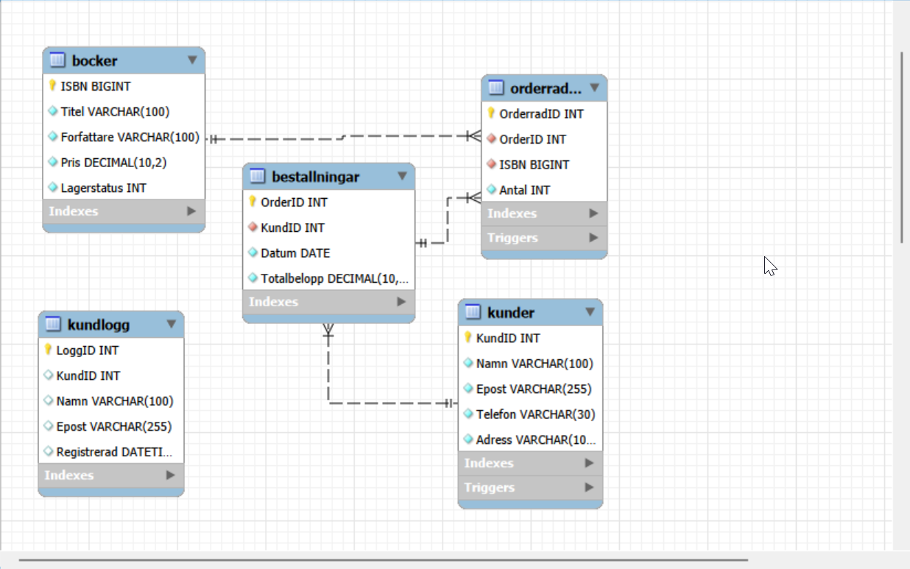

# Inlämning 2

## Fortsättning på en liten bokhandel av Lucas Wenehult YH25
Jag har under denna uppgift fortsatt på bokhandeln och lagt in mer data i databasen. Jag har under denna uppgift fått lära mig mer om databaser och hur man kan börja automatisera funktioner. Jag har då skapat olika triggers som uppdaterar tabeller vid vissa scenarion. 

I min kod som ligger med här på git har jag även lagt med en hel del kod för att testa databasen. 

## Backup & Återsällning från backup
Backup skapades med: mysqldump -u root -p Bokhandel > bokhandel_backup.sql
Därefter kan jag återställa med: mysql -u root -p Bokhandel < bokhandel_backup.sql

## Lärdommar och reflektioner från uppgiften

